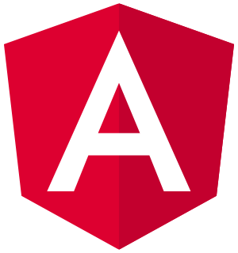

[![Stargazers][stars-shield]][stars-url]
[![Issues][issues-shield]][issues-url]
[![LinkedIn][linkedin-shield]][linkedin-url]

<br />
<br />
<p align="center">
  <a href="https://github.com/mariamshahin/mean-stack-cms">
    
  </a>
  <h3 align="center">MEAN stack CMS</h3>
  <p align="center">
    A content management system build with MEAN stack
  </p>
</p>

<!-- TABLE OF CONTENTS -->
<details open="open">
  <summary>Table of Contents</summary>
  <ol>
    <li>
      <a href="#about-the-project">About The Project</a>
      <ul>
        <li><a href="#built-with">Built With</a></li>
      </ul>
    </li>
    <li>
      <a href="#getting-started">Getting Started</a>
      <ul>
        <li><a href="#prerequisites">Prerequisites</a></li>
        <li><a href="#installation">Installation</a></li>
      </ul>
    </li>
  </ol>
</details>

## About The Project

Content management provide with authentication, authorization, users and content management

Main features:

- Authentication with registeration and login capability, profile editing
- Authorization with roles:

** Admin: able to manage all users and content<br />
=> Login: /dashboard/login<br />=> credentials: email-> admin@test.com, pw-> 654321
** Editor: able to manage all content<br />
** Author: able to manage all own content, posts and drafts<br />
** Contributer: able to manage drafts and not able to publish posts<br />
** Subscriber: not able to manage any content, only edit profile

### Built With

- [Angular](https://angular.io)
- [NGRX](https://ngrx.io)
- [Bootstrap](https://ng-bootstrap.github.io/#/home)
- [Express.js](https://expressjs.com/)
- [Mongoose.js](https://mongoosejs.com/)

## Getting Started

Make sure you have the latest nodejs and npm versions

### Prerequisites

- Update npm

  ```sh
  npm install npm@latest -g
  ```

- Install angular cli - optional
  ```sh
  npm install @angular/cli
  ```

### Installation

After cloning the repo..

1. Install NPM packages in both client and server folders - isolated environments
   ```sh
   npm install
   ```
2. Serve each client and server apps locally for development
   ```sh
   npm run dev
   ```
For building run
   ```sh
   npm run build
   ```
in both client and server then serve the built app
   ```sh
   npm start
   ```
[stars-shield]: https://img.shields.io/github/stars/mariamshahin/mean-stack-cms.svg?style=for-the-badge
[stars-url]: https://github.com/mariamshahin/mean-stack-cms/stargazers
[issues-shield]: https://img.shields.io/github/issues/mariamshahin/mean-stack-cms.svg?style=for-the-badge
[issues-url]: https://github.com/mariamshahin/mean-stack-cms/issues
[linkedin-shield]: https://img.shields.io/badge/-LinkedIn-black.svg?style=for-the-badge&logo=linkedin&colorB=555
[linkedin-url]: https://linkedin.com/in/mariamshahin
